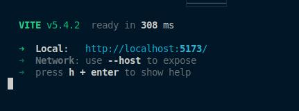

# Documentação Técnica


## CLI

Uma aplicação de linha de comando (CLI) em TypeScript para gerenciar uma árvore hierárquica de palavras. A aplicação deve realizar as seguintes funções:

1. **Carregar a Árvore:** Ler e construir uma estrutura de árvore onde cada nível representa uma profundidade específica.

2. **Analisar Frase:** Receber uma frase do usuário, identificar a profundidade das palavras presentes na frase.

3. **Exibir Resultados:** Mostrar os itens mais próximos à profundidade identificada para as palavras da frase.

### Instruções

Para executar a _CLI_, basta abrir a pasta `cli`. Execute o seguinte comando:

```bash
cd cli
```

#### Base de dados

Na pasta cli/dicts/structures.json, o arquivo `structures.json` contém a estrutura da árvore de palavras. Para adicionar um nó, basta adicionar um objeto contendo os atributos `node`, `name` e `parent`.

```json
{
  "node": 1,
  "name": "Peixes",
  "parent": "Animais"
}
```

Tambem é possiível usar a _cli_ para adicionar o um novo objeto ao arquivo json:

```bash
bun run cli.ts add --node <number> --name <string> --parent <string>
```

| Opção                  | Descrição                                                       |
| ---------------------- | --------------------------------------------------------------- |
| `bun run cli.ts`       | Executa o arquivo `cli.ts` usando o gerenciador de pacotes Bun. |
| `add`                  | Comando para adicionar um nó.                                   |
| `-nd --node <number>`  | Define o número do nó.                                          |
| `-n --name <string>`   | Define a palavra a ser adicionada.                              |
| `-p --parent <string>` | Define a palavra pai.                                           |

### Linha de Comando

```bash
bun run cli.ts analyze --depth <number> --verbose <string>
```

| Opção              | Descrição                                                                                   |
| ------------------ | ------------------------------------------------------------------------------------------- |
| `bun run cli.ts`   | Executa o arquivo `cli.ts` usando o gerenciador de pacotes Bun.                             |
| `analyze`          | Comando para analisar uma frase.                                                            |
| `--depth <number>` | Define a profundidade específica para a análise (substitua `<number>` pelo valor desejado). |
| `--verbose`        | Habilita a saída detalhada da execução (modo verboso).                                      |
| `<string>`         | A frase a ser analisada.                                                                    |

##### Exemplo Comando

```bash
bun run cli.ts analyze --depth 3 --verbose "A árvore hierárquica de palavras é útil."
```

*Verfica se no nivel hierquico 3 existe algumas das palavras na frase "A árvore hierárquica de palavras"*

##### Output

```bash
Tempo de verfificação dos parâmetros: 0.31 ms
Tempo de verficação da frase: 0.14 ms
Bovídeos = 1;
Primatas = 1;
```

## Frontend

Interface web construida com React e TypeScript que permita ao usuário criar uma hierarquia de palavras.

Para abrir o frontend, basta executar o seguinte comando:

```bash
cd ui
npm run dev
```

### Output



[Acessar o localhost](http://localhost:5173/)

## Authors

- [@benedictotavio](https://github.com/benedictotavio)
